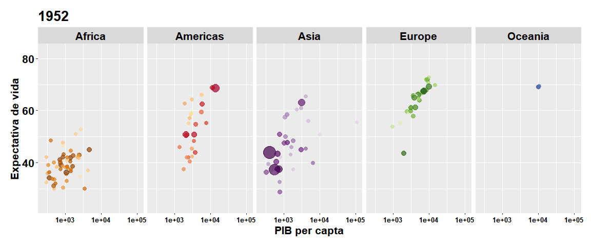

<h1>
Olá!
</h1>

Meu nome é Pedro Lima

Formado em geofísica \| Mestre em ciências e tecnologias espaciais

Atualmente tenho estudado Linguagem R e outras tecnologias com foco em
ciência de dados, principalmente manipulação, limpeza, mineração de
dados e criação de modelos estatísticos e de machine learning.

Experiência em análise de séries temporais e dados geoespacias.

 

<h3>
Tecnologias e ferramentas:
</h3>

<h3>
Estou aprendendo:
</h3>

<h3>
Contatos:
</h3>

